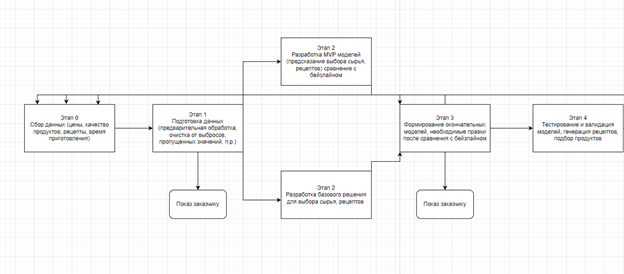
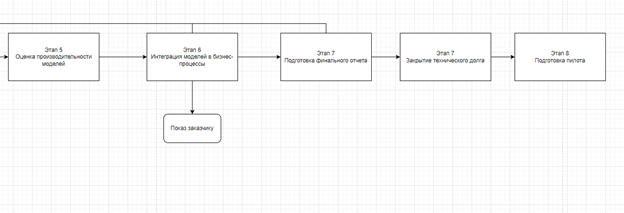
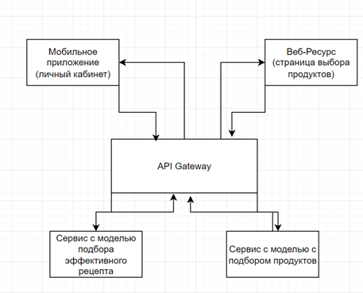
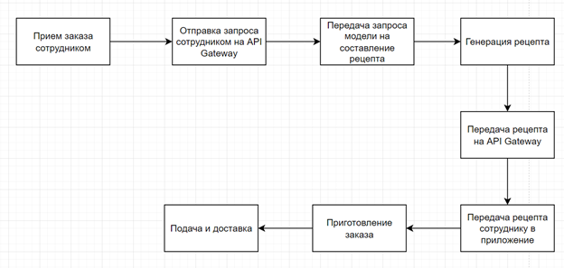
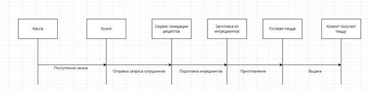
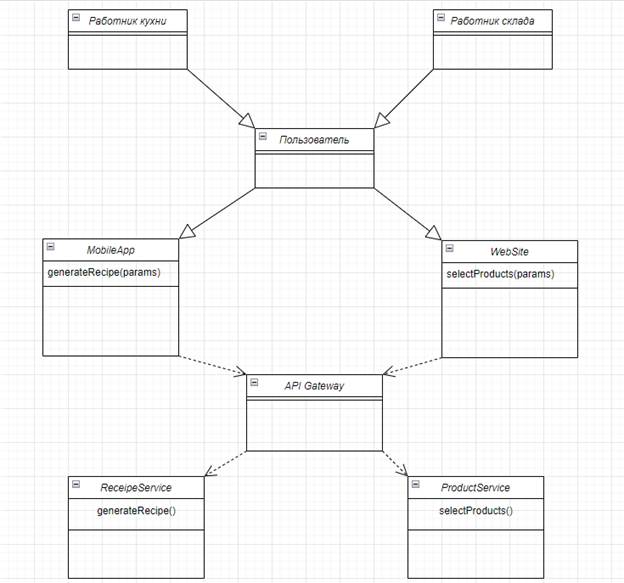

**1. Цели и предпосылки** 

1. **Зачем идем в разработку продукта?** 
- Бизнес-цель - Увеличить эффективность производства пиццы в сети ресторанов, сократив время приготовления и улучшив качество продукции. 
- Почему станет лучше, чем сейчас, от использования ML: 
  - Предложение оптимизации времени приготовления за счет предложения оптимальных методов и параметров для каждого вида пиццы с минимальным временем приготовления. 
  - Будет реализована рекомендательная система на основе базы продуктов с целью выбора наиболее качественного и недорогого сырья для пиццы. 
- Что будем считать успехом итерации с точки зрения бизнеса: 
1. Повышение удовлетворенности клиентов сервисом за счет повышения качества продукции. 
1. Сокращение времени приготовления пиццы за счет предложения оптимальных методов приготовления. 
1. Снижение цены на приготовления за счет понижения цен на сырье. 
1. Увеличение объемов производства за счет понижения цен на сырье. 
1. Увеличение конкурентоспособности, получение преимущества перед теми, кто не интегрировал ML в свои информационные системы. 
1. Рост репутации бренда. 
1. Как следствие, увеличение прибыли. 
2. **Бизнес-требования и ограничения** 
- Краткое описание: 
  - Разработать модель машинного обучения для предложения оптимальных методов и параметров приготовления. 
  - Разработать модель машинного обучения для реализации рекомендательной системы на основе базы продуктов с целью выбора наиболее качественного и недорогого сырья для пиццы. 
- Бизнес-ограничения: 
  - Ограниченный бюджет на разработку и внедрения моделей машинного обучения. 
  - Ограниченные вычислительные мощности компании. 
  - Временные ограничения – система должна быть внедрена не позднее определенного времени. 
  - Законодательные ограничения в области рекомендательных технологий. 
- Что мы ожидаем от конкретной итерации: 

  На данной итерации поставлены следующие задачи: 

1. Разработка рекомендательной системы на основе базы продуктов. 
1. Разработка рекомендательной системы оптимальных методов приготовления пиццы. 
1. Понижение затрат компании на сырье на 20%. 
- Описание бизнес-процесса пилота, насколько это возможно - как именно мы будем использовать модель в существующем бизнес-процессе?  

  Модели на данном этапе планируется использовать следующим образом: 

1. Сбор данных о поставщиках, ингредиентах, сырье для модели рекомендаций сырья. Анализ цен. 
1. Сбор данных о различных методах приготовления пиццы, сравнения их, поиск более оптимального. 
1. Подготовка данных, обработка и очистка их.  
1. Разработка моделей. 
1. Интеграция моделей в текущие бизнес процессы. 
1. Тестирование и оценка эффективности. 
1. Оценка результатов, принятие решения о масштабировании проекта. 
- Что считаем успешным пилотом? Критерии успеха и возможные пути развития проекта: 
1. Увеличение прибыли. 
1. Повышение удовлетворенности клиентов сервисом. 
1. Снижение затрат на сырье. 
1. Освоение сотрудниками разработанной информационной системы. 
3. **Что входит в скоуп проекта/итерации, что не входит** 
- На закрытие каких БТ подписываемся в данной итерации: Data Scientist может подписываться за закрытие бизнес-требований, связанных с разработкой, обучением и тестированием моделей машинного обучения, отвечая за такие параметры как точность, скорость и удовлетворение пользовательских потребностей. 
- Что не будет закрыто Data Scientist: Data Science не будет ответственен за развертывание моделей в продакшн, интеграцию с другими информационными системами, обучение персонала и обеспечение безопасности системы. 
- Описание результата с точки зрения качества кода и воспроизводимости решения Data Scientist: Результаты должны включать чистый и документированный код моделей, хорошо структурированные блокноты с комментариями, документация по воспроизводству обучения моделей, а также отчеты о тестировании с указанием метрик и результатов. 
- Описание планируемого технического долга (что оставляем для дальнейшей продуктивизации) Data Scientist: 

  Оптимизация кода для улучшения производительности, дополнительные исследования для улучшения качества модулей, а также доработку документации и комментариев для повышения понятности исходного кода. 

4. **Предпосылки решения** 
- Описание всех общих предпосылок решения, используемых в системе – с обоснованием от запроса бизнеса: какие блоки данных используем, горизонт прогноза, гранулярность модели, и др: 
1. Блоки данных: решение может использовать данные о поставщиках сырья (цены, качество продукции), данные о процессах приготовления пиццы (рецепты, время приготовления). 
2. Горизонт прогноза – для прогнозирования времени приготовления пиццы выбираем горизонт в несколько часов, для прогнозирования времени на цены на сырье – несколько месяцев. 
2. Гранулярность модели – модель прогнозирования спроса на сырье может иметь гранулярность по неделям, модель оптимизации времени приготовления – по часам. 
2. Выбор методов и алгоритмов – для прогнозирования времени приготовления используем временные ряды, для рекомендательной системы коллаборативную фильтрацию.  

**2. Методология Data Scientist** 

1. **Постановка задачи** 
- Что делаем с технической точки зрения: рекомендательная система, поиск аномалий, прогноз, оптимизация, и др. Data Scientist: 
1. Разработка и обучение моделей машинного обучения для рекомендаций по выбору сырья, разработка и обучение моделей машинного обучения для оптимизации времени приготовления. 
1. Поиск аномалий – обнаружение аномалий в данных о поставках сырья или процессах приготовления. Позволит выявить непредвиденные ситуации, влияющие на эффективность бизнес- процессов. 
1. Анализ данных – проведение разведочного анализа данных для выявления закономерностей, трендов. Позволит получить более глубокое понимание данных, влияние их на бизнес-процессы. 
2. **Блок-схема решения** 

На данной блок схеме изображен процесс разработки и внедрения моделей. Также здесь указаны этапы с тестированием, оценкой производительностью, этапы показа моделей заказчику. 

3. **Этапы решения задачи Data Scientist** 
- Этап 0, сбор данных: 

  Собираем данные о ценах и качестве продуктов, рецептах, времени приготовления. Необходимо обеспечить наличие данных из разных источников, таких как базы данных пиццерии или поставщики продуктов. 

  Риски: 

1. Недостаточное количество или качество данных о ценах и качестве продуктов. Способ противодействия: привлечение новых источников данных, расширение существующих.  
1. Недостоверность источников данных о рецептах и времени приготовления. Способ противодействия: уделить достаточное внимание предобработке данных. 

|**Название данных** |**Есть ли данные в компании (если да, название источника/витрин)** |
**Требуемый ресурс для получения** 

**данных (какие роли нужны)** 
|**Проверено ли качество данных (да, нет)** |
| :-: | :-: | - | :-: |
|**Рецепты** |**Да (База данных пиццерии)** |**DE/DS** |**+** |
|**Цены на ингредиенты** |**Да (Система учета поставщиков)** |**DE/DS** |**+** |

На выходе этапа должны быть собранные и проверенные данные о рецептах и ценах на ингредиенты, готовые для дальнейшего анализа и использования в моделях. 

- Этап 1, подготовка данных, выбираем подходящие данные по продуктам и рецептам 

  Описание для MVP: 

  Формирование выборки: Разделяем данные на обучающую, тестовую и валидационные выборки, учитывая репрезентативность данных для обучения и экспериментов. 

  Обучающая выборка включает в себя данные за прошедшие 6 месяцев, тестовая за последний месяц, валидационная – за последнюю неделю. Горизонт, гранулярность, частота пересчета: Используем данные за последний год с гранулярностью по дням. Пересчет моделей будет происходить каждую неделю. 

  Целевая переменная: стоимость рецепта. Если у нас есть данные о рецептах и их стоимости, то целевой переменной будет стоимость приготовления одной порции пиццы. 

  Используемые метрики качества: MAE, MAPE, так как они хорошо интерпретируемы и связаны с бизнес-результатом. Если МАЕ будет составлять 50 рублей, значит, что модель ошибается в среднем на 50 рублей при предсказании стоимости рецепта. 

  Необходимый результат: обученные и проверенные данные, готовые для использования в моделях выбора оптимального решения. Например, после подготовки данных мы получим обучающий набор данных, содержащий информацию о составе пицц, их стоимости и других факторов. 

  Описание для бейзлайна: 

  Формирование выборки, горизонт, гранулярность, частота, целевая переменная метрики – те же. Для базового решения мы также будем использовать данные за последний год с гранулярностью по дням и будем предсказывать стоимость рецепта. 

  Необходимый результат – аналогично, но без необходимости включения дополнительных факторов или сложных признаков. Например, для базового решения используется простая эвристика или средняя стоимость рецепта без учета других факторов. 

  Риски: 

1. Потеря информации в результате предобработки и очистки данных о продуктах и рецептах, в случае, например, случайного удаления важных деталей вроде основных ингредиентов.  

   Способ решения: 

   Предположим, что в данных о рецептах пицц есть строки с отсутствующими значениями в столбце "Время приготовления". Вместо того, чтобы просто удалить эти строки, заполним пропущенные значения, основываясь на среднем времени приготовления похожих рецептов или на основе других признаков, таких как состав или тип пиццы. 

2. Неоднородность данных о ценах и качестве, что затрудняет их объединение, в случае, например, данных о стоимости из различных источников, затрудняющих согласование и объединение. 

   Способ решения: 

   Предположим, что имеются данные о ценах на ингредиенты пиццы, представленные в разных валютах. Будем использовать коэффициенты конверсии для приведения всех цен к одной валюте, такой как рубль, чтобы обеспечить их сопоставимость и объединение. 

3. Проблемы с качеством данных о времени приготовления, включая выбросы и пропуски, что может привести к искажению результатов моделирования. 

   Способ решения: 

   Если имеются данные о времени приготовления пиццы, и были замечены выбросы в виде необычно коротких или длинных времен приготовления, то мы можем применить статистические методы, такие как межквартильный размах или z-оценки, чтобы выявить эти выбросы. Например, если большинство пицц готовится за 10-30 минут, а некоторые рецепты указывают время приготовления менее 5 минут или более 1 часа, это может указывать на ошибки или неточности в данных. Такие записи можно удалить или заполнить их более правдоподобными значениями, основываясь на типе пиццы, используемых ингредиентах или других факторах. 

- Этап 2, разработка MVP моделей и базового решения, обучаем модели на основе данных о рецептах, продуктах: 

  Описание для MVP: 

  Формирование выборки: для обучения моделей используем данные о рецептах, ценах на ингредиенты и других факторах, влияющих на стоимость. Разделяем выборку на обучающую, тестовую и валидационную с учетом временной структуры данных. 

  Горизонт, гранулярность, частота пересчета: рассматриваем данные за последний год, с гранулярностью по дням. Пересчет моделей проводим ежедневно. 

  Целевая переменная: стоимость рецепта. 

  Используемые метрики качества: MAE, MAPE для оценки точности моделей. 

  Необходимый результат: обученные модели, способные предсказывать стоимость рецепта с высокой точностью. 

  Описание для бейзлайна: 

  Формирование выборки, горизонт, гранулярность, частота, целевая переменная метрики – те же.  

  Необходимый результат: разработано базовое решение для предсказания стоимости рецепта на основе простых правил или эвристик. 

  Риски: 

1. Недооценка сложности моделей для предсказания выбора сырья и оптимальных рецептов. Например, в процессе разработки модели предсказания выбора сырья для пиццы не учтено достаточное количество факторов, таких как сезонность ингредиентов, что может привести к недостаточной точности прогнозов. 

   Способ решения: 

   Вместо использования простых линейных моделей можно применить алгоритмы глубокого обучения, которые могут лучше улавливать нелинейные зависимости между признаками. Кроме того, можно расширить набор данных, включив более широкий спектр ингредиентов и их характеристик. 

2. Неэффективное использование данных для построения моделей, например, если в модели выбора сырья для пиццы данные о качестве ингредиентов использовались без учета времени их поставки. Это может привести к тому, что модель не учитывает возможные изменения в качестве продуктов в зависимости от сезона или поставщика, что снизит точность прогнозов. 

   Способ решения: 

   Пересмотр процесса сбора данных о качестве ингредиентов, включая дополнительные характеристики (например, происхождение, производителя, срок годности) и учет временных изменений. Также можно использовать методы feature engineering для создания новых признаков на основе имеющихся данных, что может улучшить качество модели. 

3. Проблемы с интерпретацией результатов моделей и выбором подходящего алгоритма, возможность выбора между различными алгоритмами машинного обучения может привести к затруднениям в определении наилучшего метода для решения конкретной задачи прогнозирования выбора сырья и рецептов пиццы. 

   Способ решения: 

   Проведение сравнительного анализа различных алгоритмов машинного обучения (например, случайный лес, градиентный бустинг) на наборе данных, а также оценка их интерпретируемости и точности. В результате выбирается наиболее подходящий алгоритм для конкретной задачи и производится его дальнейшая настройка. 

- Этап 3, формирование окончательных моделей, правки, сравниваем с базовым решением: 

  Используемые параметры – аналогичны предыдущим. 

  Необходимый результат – окончательные модели, оптимизированные с учетом результатов сравнения с базовым решением и дополнительных правок, способные генерировать осмысленные рецепты и принимать решения о закупке продуктов. 

  Риски: 

1. Непредвиденные трудности с обучением окончательных моделей на больших объемах данных. Модель может не справиться с учетом всех вариаций и взаимосвязей между ингредиентами при обучении на большом объеме данных о рецептах. 

   Способы решения: 

   Проведение дополнительного анализа данных для выявления особенностей и взаимосвязей, а также использование более сложных моделей с учетом этих особенностей. 

2. Необходимость дополнительной оптимизации и правок после сравнения с базовыми моделями. После сравнения с базовыми моделями может выясниться, что требуется дополнительная настройка параметров для улучшения качества прогнозов. 

Способы решения: 

Постоянное мониторинг качества моделей и их результатов, а также быстрая реакция на выявленные проблемы. 

3. Проблемы с масштабированием и обработкой больших объемов данных в реальном времени. При масштабировании модели для работы в реальном времени возникают задержки из-за большого объема данных, что может привести к невозможности обработки запросов пользователей вовремя. 

   Способы решения: 

   Использование распределенных систем и оптимизация кода для обеспечения быстрой и эффективной обработки данных в реальном времени. 

- Этап 4, тестирование и валидация моделей, генерация рецептов, подбор продуктов 

  Необходимый результат: протестированные и валидированные модели, готовые для дальнейшего использования в бизнес процессах. 

  Риски: 

1. Недостаточное покрытие тестами всех возможных сценариев использования моделей. 

   Способы решения: 

   Увеличение тестового покрытия, проработка различных, нетривиальных тестовых случаев. 

2. Проблемы с проверкой точности прогнозов и оценкой их достоверности. 

   Способы решения: 

   Корректировка моделей, разработка метрик качества, подходящие под бизнес-цели. Можно использовать метрики, основанные на фактической и предсказанной стоимости пиццы. 

3. Неэффективное использование рекомендаций моделей для генерации рецептов и подбора продуктов. 

   Способы решения: 

   Метрики качества, как и в предыдущем примере. 

- Этап 5, оценка производительности моделей 

  Необходимый результат: оценка производительности моделей и их пригодность для использования в реальных условиях. 

  Риски: 

1. Непредвиденные трудности с производительностью моделей при больших объемах данных. 

   Анализ кода для нахождения узких мест, оптимизация их в случае нахождения. 

2. Проблемы с масштабированием и распределением нагрузки на модели в реальных условиях. 

   Способы решения: 

   Рассмотрение возможности применения параллельных и распределенных вычислений. Использование соответствующих технологий и фреймворков. 

3. Необходимость дополнительной оптимизации моделей для улучшения их производительности. 

   Способы решения: 

   Внедрение систем мониторинга для оперативного реагирования на выявляемые проблемы. Проведение аудита кода на предмет возможности оптимизации. 

- Этап 6, интеграция моделей в бизнес процессы: 

  Перед интеграцией необходимо убедиться, что были пройдены все этапы разработки и тестирования, а также модели оптимизированы для работы в реальных условиях. Модели должны быть готовы к автоматической обработке запросов и выдаче рекомендаций. 

  Необходимый результат – интегрированные модели в бизнес процессы пиццерии, готовые к использованию в повседневной деятельности. 

  Риски: 

1. Недооценка влияния интеграции моделей на бизнес-процессы и их пользователей. Например, рецепты и продукты, предлагаемые моделью, могут не совпадать с мнением пользователей. 

   Способы противодействия: 

   Обучение персонала, объяснение преимуществ и цели интеграции моделей. 

2. Проблемы с согласованием работы моделей с другими компонентами бизнес-системы. Непредвиденные сбои могут возникнуть при взаимодействии с базами данных или существующими программными интерфейсами. 

   Способы решения: 

   Проведение интеграционного тестирования остальных систем. Доработка их исходного кода в случае возникновения ошибок. 

3. Необходимость дополнительной настройки и поддержки моделей после их интеграции. Модели могут требовать обновлений или изменений в связи с изменениями в бизнес процессах или требованиях пользователей. 

Способы решения: 

Регулярный мониторинг и обратная связь для максимально быстрой адаптации моделей под изменяющиеся условия. 

- Этап 7, подготовка финального отчета: 

  Необходимый результат: 

  Подготовлен финальный отчет для бизнеса, включающий описание проведенных работ, результаты анализа, принятые решения и рекомендации для дальнейших действий. Отчет должен быть понятным и информативным для бизнес-пользователей и заинтересованных сторон. 

  Риски: 

1. Неполнота или некорректность представления результатов и выводов в отчете. 

   Способы решения: 

   Дополнительные проверки, верификация. 

2. Проблемы с интерпретацией результатов моделей и их значимости для бизнеса. 

   Способы решения: 

   Понятное объяснение, использование простого языка, минимизация использования сложной технической терминологии, не понятной для бизнес-пользователей. 

3. Необходимость дополнительной документации и пояснений для понимания отчета бизнес-пользователя. 

   Способы решения: 

   Включение определения ключевых понятий, методологии анализа. 

- Этап 8, закрытие технического долга: 

  Необходимый результат: Закрытие технического долга, улучшение качества и производительности моделей. 

**3. Подготовка пилота** 

1. **Способ оценки пилота** 

В контексте пилота будем использовать методику A/B тестирования. Одна группа пользователей будет экспонирована новой модели выбора оптимальных рецептов и продуктов, а другая будет использовать текущий подход. Будет происходит сравнение ключевых метрик, таких как скорость и стоимость приготовления одной пиццы, количество пицц, произведенное каждой группой, жалобы клиентов на качество продуктов, подобранных моделью.  

2. **Что считаем успешным пилотом** 

Успешным пилотом считается повышение скорости готовки, удешевление производства и, как следствие, рост прибыли. 

Пилот считается успешным если: 

1. Приготовление пиццы было ускорено на 20%. 
1. Стоимость пиццы была понижена на 15%.  
3. **Подготовка пилота** 

Для успешной подготовки пилота, мы должны учитывать не только ожидаемые затраты на вычисления, но и специфику данных о рецептах и продуктах. 

1. Оценка вычислительных затрат: Предположим, имеется база данных с информацией о рецептах пицц, включающая список ингредиентов, их стоимость и доступность. Для подготовки пилота, мы должны рассчитать ожидаемую вычислительную сложность нашей модели, учитывая объем данных и требования к вычислениям. Например, если у нас есть 1000 различных рецептов и 50 ингредиентов, мы должны оценить, сколько времени и ресурсов потребуется для обучения модели на этих данных. 
1. Установка ограничений: После оценки вычислительных затрат, можно установить ограничения по вычислительной сложности моделей. Например, можно определить максимальное время обучения модели или максимальный объем памяти, который мы готовы выделить для выполнения вычислений. Это поможет нам выбрать подходящие алгоритмы и методы обучения, которые соответствуют нашим ограничениям. 
1. Оптимизация параметров пилота: Можно провести итерации с моделями, подстраивая параметры пилота в соответствии с оценками вычислительной сложности. Например, можно уменьшить количество признаков или использовать более эффективные алгоритмы обучения, чтобы снизить вычислительную нагрузку. Это позволит достичь оптимального баланса между точностью моделей и затратами на вычисления. 
1. Мониторинг и анализ результатов: 

   Также, необходимо тщательно отслеживать процесс обучения моделей в рамках пилота и анализировать полученные результаты. Если будет обнаружено, что вычислительные затраты превышают ожидания или модели не достигают необходимой точности, потребуется внести коррективы в параметры пилота или выбрать альтернативные подходы. 

**4. Внедрение для production систем, если требуется** 

Заполнение раздела 4 требуется не для всех дизайн документов. В некоторых случаях результатом итерации может быть расчет каких-то значений, далее используемых в бизнес-процессе для пилота. 

1. **Архитектура решения** 

   Интеграция моделей машинного обучения в существующую информационную систему пиццерии пройдет следующим образом: 

   Модель составления эффективного рецепта будет доступна из мобильного приложения пиццерии в личном кабинете сотрудника: 

- Пользователь взаимодействует с мобильным приложением, в котором указывает необходимые параметры для составления эффективного рецепта 
- Мобильное приложение отправляет запрос на API Gateway, являющийся точкой входа для доступа ко всем микросервисам 
- Сервис с моделью подбора эффективного рецепта генерирует рецепт на основе параметров, принятых от API Gateway 

Модель выбора продуктов будет доступна через специальный веб-ресурс. Работает по схожему с предыдущей моделью принципу: 

- Сотрудник взаимодействует с веб-ресурсом, в котором указывает продукты, на основе которых модель должна принять решение о выборе 
- Веб-ресурс отправляет запрос на API Gateway, являющийся точкой входа для доступа ко всем микросервисам 
- Сервис с моделью, на основе параметров, принятых от API Gateway, модель выбирает продукты 
- Сотрудник может заказать продукты через сторонние ресурсы 

2. **Описание инфраструктуры и масштабируемости** 
- Какая инфраструктура выбрана и почему Data Scientist 
- Плюсы и минусы выбора Data Scientist 
- Почему финальный выбор лучше других альтернатив Data Scientist 
3. **Требования к работе системы** 
1. Throughput SLA: 
- Гарантированная пропускная способность: Минимум 1000 запросов в секунду. 
- Пиковая пропускная способность: До 5000 запросов в секунду. 
- Измерение: Пропускная способность будет измеряться в реальном времени и агрегироваться на основе среднего значения за определенный период времени, например, в течение часа или дня. 
- Последствия нарушения: Если пропускная способность упадет ниже гарантированного значения в течение длительного времени (например, более 5 минут), это будет рассматриваться как нарушение SLA, и будет предусмотрено возмещение клиенту. 
2. Latency SLA: 
- Максимальная задержка для обработки запроса: Не более 100 миллисекунд. 
- Измерение: Задержка будет измеряться как время, прошедшее с момента получения запроса до момента отправки ответа. 
- Последствия нарушения: Если задержка в обработке запроса превысит установленный порог в течение значительного времени (например, более 1 минуты), это также будет рассматриваться как нарушение SLA, и будут предусмотрены меры для улучшения производительности и возмещения 

  клиенту. 

4. **Безопасность системы** Потенциальные угрозы: 
1. Внутренние нарушители 
1. Внешние нарушители 

   Внутренними нарушителями являются сотрудники компании. Внешними нарушителями являются клиенты, хакеры-злоумышленники, конкуренты. 

5. **Безопасность данных** 

В системе настроены аутентификация и авторизация для мобильного приложения и веб ресурса. Пароли хранятся в захешированном виде, реализована система мониторинга и аудита. В качестве протоколов используется https, доступ к модели осуществляется через корпоративный VPN. 

6. **Издержки** 
- Инфраструктура и оборудование: 60 000 рублей в месяц, в зависимости от выбранного облачного провайдера и необходимых ресурсов. 
- Разработка и поддержка ПО: 270 000 рублей в месяц на оплату работы разработчиков и поддержку ПО. 
- Обучение персонала: 50 000 рублей в месяц на обучение сотрудников и приобретение обучающих материалов. 
- Безопасность: 80 000 рублей в месяц на обеспечение безопасности системы и данных. 
- Управление данными: 90 000 рублей в месяц на услуги облачного хранения данных и их обработку. 
- Техническая поддержка и обслуживание: 120 000 рублей в месяц на обеспечение технической поддержки и регулярное обслуживание системы. 
- Лицензирование и сертификация: 30 000 рублей в месяц на необходимые лицензии и сертификации. 
5. **Integration points** 
1. Мобильное приложение: 

Запрос на составление рецепта: 

- Метод: POST 
- URL: /recipe/generate 
- Тело запроса: JSON с параметрами рецепта 
2. Веб-ресурс (сайт): 

Запрос на выбор продуктов: 

- Метод: POST 
- URL: /product/select 
- Тело запроса: JSON с параметрами для выбора продуктов 
3. API Gateway: 

`   `Проксирование запросов к соответствующим сервисам: 

- Метод: POST 
- URL для рецептов: /recipe-service/generate 
- URL для продуктов: /product-service/select 
- Тело запроса: Пробрасывается без изменений 
4. Сервис составления рецептов:    Запрос на составление рецепта: 
- Метод: POST 
- URL: /generate-recipe 
- Тело запроса: JSON с параметрами рецепта 
5. Сервис выбора продуктов: 

`   `Запрос на выбор продуктов: 

- Метод: POST 
- URL: /select-products 
- Тело запроса: JSON с параметрами для выбора продуктов 
6. **Риски** 
- Риск генерации моделью ошибочных рецептов 
- Риск принятия моделью неправильного решения о покупке более дорогих продуктов, чем следовало 
- Риск переобучения модели 
- Риск недостаточной интеграции с текущей системой 
- Риски непредвиденных текущих проблем 

**4.7 Диаграммы** 

Диаграмма последовательности:

Диаграмма потоков данных: 

Диаграмма классов: 

